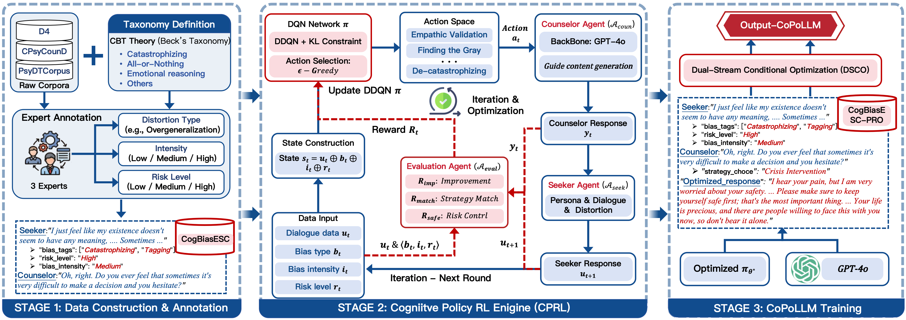

# Cognitive Policy-Driven LLM for Diagnosis and Intervention of Cognitive Distortions in Emotional Support Conversation



## Overview

Emotional Support Conversation (ESC) plays a critical role in mental health assistance by providing accessible psychological support in real-world applications. Large Language Models (LLMs) have shown strong empathetic abilities in ESC tasks. However, existing methods overlook the issue of **cognitive distortions** in help-seekers' expressions. As a result, current models can only provide basic emotional comfort, rather than helping help-seekers address their psychological distress at a deeper cognitive level.

**CoPoLLM** (Cognitive Policy-driven Large Language Model) is a framework designed to enhance LLMs' ability to diagnose and intervene in cognitive distortions in help-seekers. The framework is built upon Cognitive Behavioral Therapy (CBT) theory and consists of two key components:

- **CPRL (Cognitive Policy Reinforcement Learning) Engine**: Learns optimal intervention strategies using multi-agent simulation and Deep Q-Network (DQN)
- **DSCO (Dual-stream Conditional Optimization) Algorithm**: Injects cognitive intervention knowledge into the LLM through dual-stream optimization

## Algorithm Overview

CoPoLLM addresses two fundamental challenges in emotional support conversation:

1. **Diagnosis Challenge**: Existing ESC datasets lack fine-grained cognitive distortion annotations. CoPoLLM constructs **CogBiasESC**, the first ESC dataset explicitly annotated with:
   - Cognitive distortion types (8 types based on CBT theory)
   - Intensity levels (mild, moderate, severe)
   - Risk levels (low, medium, high)

2. **Intervention Challenge**: Effective CBT requires precise strategy selection tailored to distortion characteristics. CoPoLLM:
   - Trains a DQN agent to autonomously explore optimal intervention strategies through multi-agent simulation
   - Uses DSCO to inject learned policy knowledge into LLMs
   - Provides safety guarantees for high-risk scenarios

## Dataset

### CogBiasESC

The CogBiasESC dataset contains emotional support conversations annotated with cognitive distortion information:

- **Training set**: 2,094 dialogues, 34,329 seeker utterances
- **Test set**: 405 dialogues, 5,568 seeker utterances
- **Total**: 2,499 dialogues, 39,897 seeker utterances

**Files**:
- `data/train.json`: Training dialogues with cognitive distortion annotations
- `data/test.json`: Test dialogues for evaluation

### Cognitive Distortion Types (Based on CBT Theory)

1. **Emotional Reasoning**: Presuming subjective feelings define objective reality
2. **Catastrophizing**: Anticipating worst-case outcomes
3. **All-or-Nothing**: Viewing situations in binary categories
4. **Personalization**: Assuming responsibility for external events
5. **Labeling**: Attaching negative global labels
6. **Overgeneralization**: Drawing broad patterns from single incidents
7. **Mind Reading**: Assuming knowledge of others' thoughts
8. **Should Statements**: Applying rigid rules about how things ought to be

## Project Structure

```
CoPoLLM/
├── data/
│   ├── train.json                # 2,094 training dialogues
│   └── test.json                 # 405 test dialogues
│
├── task1/                        # Data Preparation
│   ├── create_dqn_dataset.py     # Create DQN training pool with embeddings
│   └── get_bias_label.py         # Annotate cognitive distortions from raw data
│
├── task2/                        # CPRL Engine (DQN Training)
│   ├── config.yaml               # Hyperparameters and DQN architecture
│   ├── config_loader.py          # YAML configuration with ablation support
│   ├── dqn.py                    # Double DQN implementation
│   ├── multi_agents.py           # Multi-agent counseling simulation
│   └── run_online_training.py    # Main training loop (100k episodes)
│
├── task3/                        # SFT Dataset Generation
│   └── generate_sft_dataset.py   # Generate supervised fine-tuning data
│
├── task4/                        # DSCO Fine-tuning
│   ├── sft_unified.py            # Unified training (classification + generation)
│   ├── sft_classification.py     # Distortion type classification task
│   └── sft_generation.py         # Response generation task
│
├── Figures/
│   └── method.png                # Framework architecture
├── requirements.txt              # Python dependencies
└── README.md                     # This file
```

## Installation

### Prerequisites

- Python 3.8+
- CUDA 11.8+ (GPU recommended)
- 80GB GPU memory (for full training pipeline)

### Setup

```bash
# Clone repository
git clone https://github.com/[your-org]/CoPoLLM.git
cd CoPoLLM

# Install dependencies
pip install -r requirements.txt

# Optional: Install Unsloth for faster training
pip install unsloth
```

## Usage Guide

The complete pipeline has four sequential stages:

### Stage 1: DQN Dataset Preparation (Task 1)

Extract cognitive distortion labels and create embeddings for DQN training.

```bash
cd task1

# Annotate cognitive distortions (requires LLM API)
python get_bias_label.py \
    --input ../data/train.json \
    --output outputs/annotated.json \
    --api local

# Create DQN training pool with embeddings
python create_dqn_dataset.py \
    --input outputs/annotated.json \
    --output outputs/dqn_pool.jsonl
```

**Key Output**: JSONL file with state embeddings and annotations

### Stage 2: CPRL Engine Training (Task 2)

Train DQN agents through multi-agent simulation with CBT strategies.

```bash
cd task2

# Configure parameters in config.yaml (optional)
# Default settings: 10,000 episodes, 32 parallel environments

# Run training
python run_online_training.py --config config.yaml
```

**Hyperparameters**:
- Episodes: 10,000
- Parallel Environments: 32
- DQN Architecture: 1024 → 256 → 128 → 10 (embedding → hidden → hidden → actions)
- Learning Rate: 1e-4
- Batch Size: 32
- Discount Factor (γ): 0.8
- Epsilon-Greedy: 0.9 → 0.1 over 5,000 steps
- Target Update: Every 10 batches
- Replay Buffer: 10,000 capacity
- KL Constraint: β = 0.1 (for KL-regularized Double DQN)

**Key Output**: `policy_net_final.pth` (trained DQN model)

### Stage 3: SFT Dataset Generation (Task 3)

Generate training data for LLM fine-tuning using the trained DQN.

```bash
cd task3

python generate_sft_dataset.py \
    --input ../data/train.json \
    --dqn_model ../task2/results/policy_net_final.pth \
    --output sft_dataset.json
```

This stage:
- Selects optimal intervention strategies per dialogue
- Generates improved responses using DQN + LLM
- Creates multi-task training data

**Key Output**: `sft_dataset.json` with improved responses and classifications

### Stage 4: DSCO Fine-tuning (Task 4)

Fine-tune base LLM with DSCO algorithm to internalize cognitive intervention.

```bash
cd task4

# Unified training (recommended)
python sft_unified.py \
    --model_name Qwen2.5-7B-Instruct \
    --dataset_path ../task3/sft_dataset.json \
    --output_dir models/

# Or train individual tasks
python sft_classification.py --model_name Qwen2.5-7B-Instruct --dataset_path ../task3/sft_dataset.json
python sft_generation.py --model_name Qwen2.5-7B-Instruct --dataset_path ../task3/sft_dataset.json
```

**Hyperparameters**:
- Base Models: Llama3.1-8B, Qwen3-8B, Qwen2.5-7B
- LoRA Rank (r): 16
- LoRA Alpha (α): 32
- LoRA Dropout: 0.05
- Learning Rate: 2e-4
- Batch Size: 4
- Epochs: 3
- Quantization: 4-bit (QLoRA)
- Inference: vLLM with greedy sampling (T=0.0)

**Key Output**: LoRA adapters for inference

## Model Weights

Trained CoPoLLM adapters are available on HuggingFace:

**https://huggingface.co/Chips95/Lora_Adapter_for_ACL2026_CoPoLLM/tree/main**

### Using Pre-trained Adapters

```python
from peft import PeftModel
from transformers import AutoModelForCausalLM, AutoTokenizer

# Load base model
base_model_name = "Qwen/Qwen2.5-7B-Instruct"
base_model = AutoModelForCausalLM.from_pretrained(base_model_name)
tokenizer = AutoTokenizer.from_pretrained(base_model_name)

# Load CoPoLLM adapter
model = PeftModel.from_pretrained(
    base_model,
    "[your-org]/CoPoLLM-adapters"
)

# Generate response
prompt = "Your psychological support prompt here"
inputs = tokenizer(prompt, return_tensors="pt")
outputs = model.generate(**inputs, max_length=128, temperature=0.0)
response = tokenizer.decode(outputs[0], skip_special_tokens=True)
print(response)
```

## Configuration

### CPRL Training (task2/config.yaml)

Key parameters for DQN training customization:

```yaml
training:
  k_episodes: 10000                  # Total training episodes
  batch_size: 32                     # Gradient update batch size
  learning_rate: 1e-4                # DQN learning rate
  gamma: 0.8                         # Discount factor
  num_parallel_environments: 32      # Parallel agents

dqn_architecture:
  embedding_dim: 1024                # Input dimension
  hidden_dim_1: 256                  # First hidden layer
  hidden_dim_2: 128                  # Second hidden layer
  action_dim: 10                     # Actions (9 strategies + crisis)

epsilon_greedy:
  eps_start: 0.9                     # Initial exploration
  eps_end: 0.1                       # Final exploration
  eps_decay_steps: 5000              # Decay schedule

update:
  target_update_interval: 10         # Update target network
  replay_buffer_capacity: 10000      # Experience replay size

ablation:
  disable_kl_constraint: false
  disable_ddqn: false
  disable_safety_reward: false
```

### DSCO Fine-tuning (task4/)

LoRA and training configuration:

```bash
--model_name Qwen2.5-7B-Instruct
--lora_r 16
--lora_alpha 32
--lora_dropout 0.05
--learning_rate 2e-4
--num_train_epochs 3
--per_device_train_batch_size 4
```

## Citation

```bibtex
@inproceedings{zhong2025copolllm,
  title={Cognitive Policy-Driven LLM for Diagnosis and Intervention of Cognitive Distortions in Emotional Support Conversation},
  author={Zhong, Lin and Zhu, Renjin and Ma, Shujuan and Cui, Jinhao and Wang, Lingzhi and Chen, Hao and Liao, Qing},
  booktitle={Proceedings of the 63rd Annual Meeting of the Association for Computational Linguistics (ACL)},
  year={2025}
}
```

## License

MIT License - See LICENSE file for details

## Ethical Considerations

CoPoLLM is designed for research and educational use. Clinical deployment requires:

1. Not a substitute for professional mental health care
2. Crisis intervention pathways for high-risk scenarios
3. User consent and transparency about AI interaction
4. Robust privacy and data security measures
5. Continuous monitoring and safety evaluation

## Contributing

Contributions are welcome. Please open issues or submit pull requests.

## Contact

For questions, issues, or feedback, please open a GitHub issue or contact the authors.

* `train.json`: A representative subset of our synthetic training data, including cognitive distortion types, intensity, and risk levels.
* `test.json`: The test set specifically belonging to our proposed CogBiasESC benchmark.

### 2. D4 Dataset & Ethical Compliance

For the mixed benchmarks (e.g., portions of the test set involving D4), we strictly adhere to the **D4 Data Usage Agreement (DUA)**:

* **Redistribution Prohibited:** Per the SJTU X-LANCE Lab's policy (*A Chinese Dialogue Dataset for Depression-Diagnosis-Oriented Chat*), we are not authorized to share any part of the raw D4 data.

### 3. Data De-contamination

We implemented a rigorous filtering pipeline to ensure zero overlap between the training subsets and all test sets. No data leakage occurred during the GPT-4o synthesis process.


### Cognitive Distortions

Based on CBT theory, cognitive distortions are irrational thinking patterns that consistently trigger psychological distress, such as:
- **Catastrophizing**: Expecting the worst-case scenario
- **All-or-nothing thinking**: Viewing situations in binary categories
- **Overgeneralization**: Drawing broad conclusions from single events

Effective CBT requires diagnosing these distortions and providing targeted interventions to help individuals correct their irrational thoughts.

### Framework Design

CoPoLLM addresses two key challenges:

1. **Diagnostic Challenge**: Existing ESC datasets lack fine-grained cognitive distortion annotations. We construct CogBiasESC with detailed labels for distortion type, intensity, and risk level.

2. **Intervention Challenge**: Effective CBT requires precise strategy selection. Our CPRL engine autonomously explores optimal strategies through RL simulation, while DSCO injects this knowledge into the LLM.

### Safety Guarantees

CoPoLLM builds strict safety barriers in high-risk counseling scenarios through:
- Risk level assessment and classification
- Safety-aware policy learning
- Theoretical guarantees on strategy consistency and safety

## Pipeline Overview

The training pipeline consists of four main stages:

1. **Data Preparation** (Task 1): Create DQN training datasets with cognitive distortion annotations
2. **CPRL Training** (Task 2): Train DQN agents to learn optimal intervention strategies through multi-agent simulation
3. **SFT Dataset Generation** (Task 3): Use trained DQN to generate high-quality training samples
4. **DSCO Fine-tuning** (Task 4): Fine-tune LLM with DSCO algorithm to internalize cognitive intervention capabilities

## Experimental Results

CoPoLLM significantly outperforms 15 state-of-the-art baselines in:
- **Distortion Diagnosis Accuracy**: Precise identification of cognitive distortion types
- **Intervention Strategy Effectiveness**: More helpful and targeted responses
- **Safety Risk Control**: Better handling of high-risk scenarios

## Requirements

- Python 3.8+
- PyTorch
- Transformers
- (Additional dependencies to be added)

## Usage

Detailed usage instructions will be provided in the full documentation.


## License

TBD

## Contact

For questions and feedback, please open an issue in this repository.
